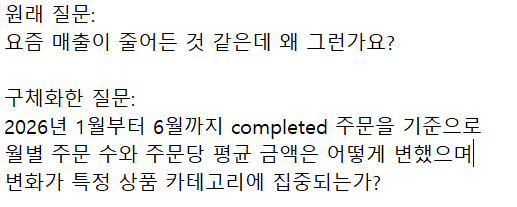
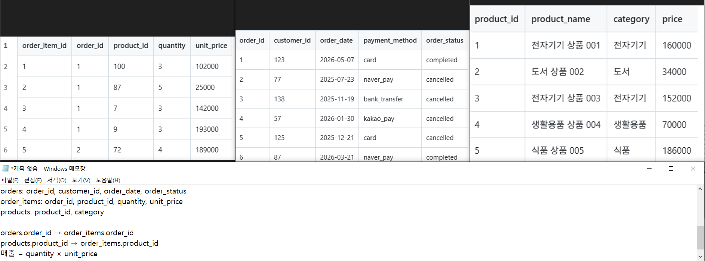
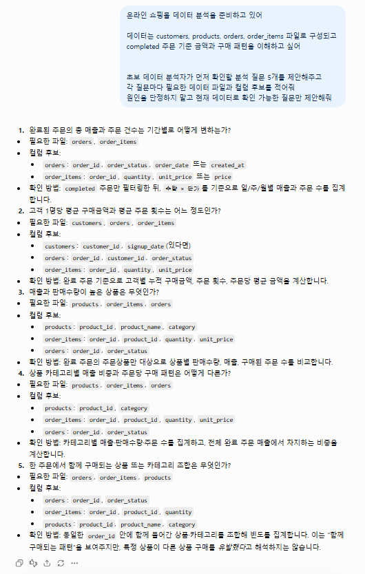
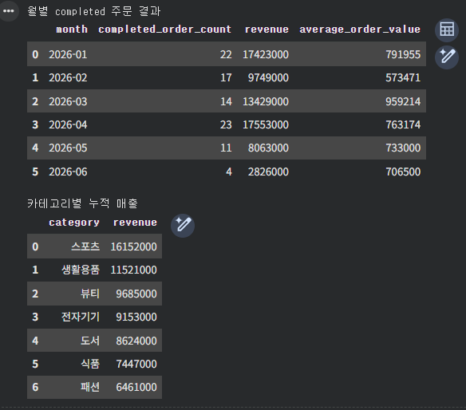
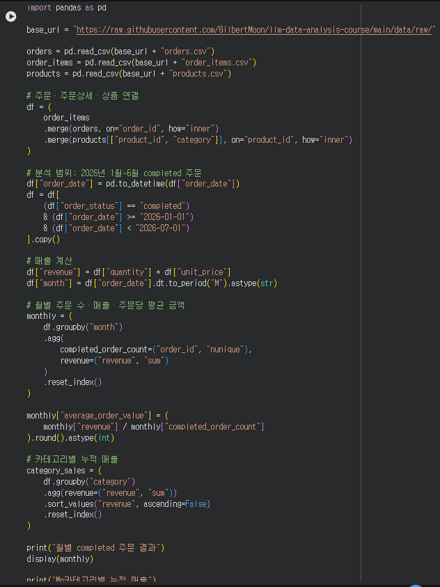

# Chapter 01 제출 답안. AI와 함께하는 데이터 분석의 시작

## 0. 제출 정보

- 이름: 오병희
- GitHub ID: OBHAR
- 개인 저장소명: `llm-data-analysis-study`
- 작성일: 2026-09-05
- 사용한 LLM: ChatGPT

### 최종 제출 URL

https://github.com/OBHAR/llm-data-analysis-study/blob/main/chapter01/chapter01.md

---

## 1. 원래 업무 질문

### 내가 선택한 막연한 질문

> 요즘 매출이 줄어든 것 같은데 왜 그런가요?

### 왜 이 질문이 모호하다고 생각했는가?

- 대상: 어떤 주문 상태의 어떤 금액인지 정해지지 않았다.
- 기간: 비교할 시작·종료 시점이 없다.
- 기준: 주문 수, 주문당 금액, 상품별 금액 중 무엇을 볼지 알 수 없다.
- 비교 방법: 전월 비교인지, 기간 전체 추세인지 정해지지 않았다.
- 분석 목적: 다음으로 확인할 의사결정 항목이 드러나지 않는다.

### 분석 가능한 질문으로 다시 작성

> 2026년 1월부터 6월까지 `completed` 주문을 기준으로 월별 주문 수와 주문당 평균 금액은 어떻게 변했으며, 변화가 특정 상품 카테고리에 집중되는가?

### 결과 관찰

분석 범위를 주문 상태, 기간, 집계 단위, 비교 지표로 나누어 정의했다. 매출은 주문 상세의 `quantity × unit_price`로 계산하고, 월별 주문 수와 주문당 평균 금액을 함께 보기로 했다.

### 나의 해석과 판단

단순 매출 변화만 보면 주문 자체가 줄었는지 또는 주문당 금액이 변했는지 구분할 수 없다. 두 지표와 카테고리를 함께 확인해야 다음 분석 방향을 판단할 수 있다고 보았다.

### 업무·분석적 의미

월별 주문 수·객단가·카테고리 변화를 분리하면 가격, 상품 구성, 수요 변화 등 후속 확인이 필요한 영역을 우선순위화할 수 있다.

### 한계와 추가 확인 사항

현재 질문만으로 변화의 원인을 확정할 수 없다. 특히 2026년 6월 데이터가 한 달 전체인지 결측·중복이 없는지와 주문 상태별 정의를 추가 확인해야 한다.

### Evidence



---

## 2. 질문과 필요한 데이터 연결

### 필요한 데이터 파일

- [x] `customers.csv`
- [x] `products.csv`
- [x] `orders.csv`
- [x] `order_items.csv`

### 필요한 컬럼 후보

| 파일 | 필요한 컬럼 | 필요한 이유 |
| --- | --- | --- |
| `orders.csv` | `order_id`, `customer_id`, `order_date`, `order_status` | 주문 식별, 월 구분, completed 필터 |
| `order_items.csv` | `order_id`, `product_id`, `quantity`, `unit_price` | 매출 계산과 주문 상세 연결 |
| `products.csv` | `product_id`, `category` | 카테고리별 변화 비교 |
| `customers.csv` | `customer_id` | 향후 고객 단위 추가 분석 시 연결 가능 |

### 데이터 연결 관계

```text
customers.customer_id → orders.customer_id
orders.order_id → order_items.order_id
products.product_id → order_items.product_id

매출 = order_items.quantity × order_items.unit_price
분석 조건 = orders.order_status = completed
```

### 결과 관찰

실제 파일에서 주문일·주문 상태·수량·단가·카테고리 컬럼을 확인했다. 선택한 질문은 `orders`, `order_items`, `products` 세 파일만으로 계산할 수 있고 `customers`는 후속 세분화 분석에 사용할 수 있다.

### 나의 해석과 판단

현재 데이터 구조만으로 월별 주문 수, 주문당 평균 금액, 카테고리별 매출을 계산할 수 있다고 판단했다. 다만 고객 이름·연락처는 분석에 필요하지 않으므로 사용하지 않는다.

### 업무·분석적 의미

질문과 데이터 연결을 먼저 확인하면 존재하지 않는 컬럼을 전제로 분석하거나 주문 상태를 섞어 잘못된 결론을 내리는 위험을 줄일 수 있다.

### 한계와 추가 확인 사항

실제 분석 전에는 날짜 형식, 결측·중복, 취소 주문의 금액 처리, 6월 데이터 수집 완료 여부를 추가 확인해야 한다.

### Evidence



---

## 3. LLM에게 분석 질문 후보 요청

### 사용 목적

막연한 매출 감소 문제를 재현 가능한 분석 질문 후보로 확장하고 필요한 파일·컬럼 후보를 초안으로 얻기 위해 사용했다.

### 사용한 Prompt

```text
온라인 쇼핑몰 데이터 분석을 준비하고 있습니다.

데이터는 customers, products, orders, order_items 파일로 구성됩니다.
completed 주문 기준 금액과 구매 패턴을 이해하고 싶습니다.

초보 데이터 분석자가 먼저 확인할 분석 질문 5개를 제안해 주세요.
각 질문마다 필요한 데이터 파일과 컬럼 후보를 적어 주세요.
원인을 단정하지 말고, 현재 데이터로 확인 가능한 질문만 제안해 주세요.
```

### LLM 답변 요약

1. 완료 주문 기준 월별 매출과 주문 건수의 변화를 확인한다.
2. 고객별 평균 구매금액과 구매 횟수를 비교한다.
3. 매출 기여도가 높은 상품을 확인한다.
4. 상품 카테고리별 매출·주문 수를 비교하고 전체 매출에서의 비중을 확인한다.
5. 반복 구매 고객이 함께 구매하는 상품 또는 카테고리 조합을 탐색한다.

### 결과 관찰

LLM은 월별 주문 추이, 고객 구매 패턴, 상품·카테고리 기여도, 반복 구매 조합의 다섯 방향을 제안했다. 또한 `orders`의 날짜 컬럼을 `order_date` 또는 `created_at` 후보로 제시했으므로 실제 데이터 확인이 필요했다.

### 나의 해석과 판단

첫 번째 제안인 월별 매출·주문 건수 비교를 선택했다. 여기에 주문당 평균 금액과 카테고리별 변화를 추가해, 매출 변화를 더 세분화해 볼 수 있도록 질문을 수정했다. 실제 데이터에는 `order_date`가 있고 `created_at`는 없으므로 이 부분도 실제 컬럼에 맞춰 수정했다.

### 업무·분석적 의미

LLM은 질문 후보와 점검 항목을 빠르게 넓히는 데 유용하지만, 데이터 구조와 계산 기준을 대신 검증할 수는 없다.

### 한계와 추가 확인 사항

LLM 답변은 실제 컬럼 타입·결측·중복을 알지 못한다. 특히 반복 구매 조합 분석은 고객·주문·상품 연결과 충분한 반복 구매 데이터가 필요하므로, 현재 단계에서는 추가 검증 전의 후보로만 남긴다.

### Evidence



---

## 4. LLM 제안 검증

| 검증 항목 | 확인 내용 |
| --- | --- |
| 선택한 LLM 제안 | 월별 주문 수·주문당 평균 금액·카테고리 변화를 함께 확인 |
| 필요한 파일 | `orders.csv`, `order_items.csv`, `products.csv` 존재 확인 |
| 필요한 컬럼 | `order_date`, `order_status`, `quantity`, `unit_price`, `category` 확인 |
| 계산 범위 | 2026-01-01~2026-06-30, `completed` 주문, 매출=`quantity × unit_price` |
| 실제 데이터 확인 필요 여부 | 날짜 완전성, 결측·중복, 주문 상태 처리 기준은 추가 확인 필요 |
| 원인 단정 여부 | 원인을 단정하지 않고 관찰된 차이만 기술 |
| 최종 판단 | 수정 후 사용 |

### 내가 수정한 내용

LLM의 일반적인 “월별 매출 비교” 제안을 2026년 1~6월, `completed` 주문, 주문 수·주문당 평균 금액·카테고리 매출이라는 구체적 기준으로 수정했다.

### 결과 관찰

`orders`에는 주문일과 주문 상태가, `order_items`에는 수량과 단가가, `products`에는 카테고리가 존재했다. 따라서 제안한 계산은 실제 데이터 구조와 연결된다.

### 나의 해석과 판단

질문의 방향은 사용할 수 있지만, 원본 제안에는 기간과 매출 계산식이 빠져 있었다. 이 기준을 보완한 뒤에만 분석 질문으로 사용하기로 판단했다.

### 업무·분석적 의미

LLM 제안을 검증하지 않으면 존재하지 않는 컬럼, 불명확한 집계 범위, 근거 없는 원인 해석을 제출할 수 있다.

### 한계와 추가 확인 사항

현재 확인은 컬럼·관계 중심이다. 실제 제출 전에는 행 수, 결측, 중복 주문, 6월 데이터의 완전성을 추가 점검해야 한다.


---

## 5. Prompt Log

- 사용 목적: 막연한 매출 질문을 검증 가능한 분석 질문으로 전환
- 입력 Prompt 요약: 네 데이터 파일의 역할과 completed 주문 분석 목적을 제시
- LLM 답변 요약: 월별 금액, 주문 수·객단가, 카테고리 비교 등의 후보 제안
- 실제 반영 여부: 기간·필터·계산식을 보완하여 일부 반영
- 사람이 검증한 항목: 파일 존재, 컬럼, PK/FK 연결, 매출 계산식, 분석 기간
- 사람이 수정한 내용: 2026년 1~6월과 `completed` 범위를 명시
- 남은 확인 사항: 결측·중복 및 6월 데이터 완전성

### 결과 관찰

Prompt Log에는 LLM이 초안을 제안한 부분과 사람이 실제 데이터 기준으로 수정·검증한 부분이 구분되어 남는다.

### 나의 해석과 판단

분석 과정에서 어떤 제안을 채택하거나 보류했는지 기록해야 나중에 결과가 나온 근거와 책임 범위를 재검토할 수 있다.


---

## 6. 개인정보와 Secret 보호 확인

- [x] 실제 이름·이메일·전화번호 등 고객 개인정보를 Prompt에 사용하지 않았습니다.
- [x] API Key를 코드나 Notebook에 직접 작성하지 않았습니다.
- [x] `.env` 실제 내용을 캡처하거나 업로드하지 않았습니다.
- [x] GitHub Token, 비밀번호, 내부 URL이 캡처에 보이지 않습니다.
- [x] 제출 전 이미지까지 다시 확인했습니다.

### 나의 판단

분석에 필요하지 않은 고객 이름, 이메일, 전화번호와 모든 API Key·GitHub Token·비밀번호·실제 `.env` 내용은 LLM과 Public GitHub에 올리면 안 된다. 필요한 경우에도 고객 식별자는 최소화하거나 비식별 처리해야 한다.

---

## 7. Chapter 01 Notebook 확인

### 내 환경 상태

- [x] 아직 환경설정 전이라 Notebook 위치만 확인했습니다.
- [ ] 환경설정이 완료되어 Notebook을 직접 실행했습니다.

### 결과 관찰

Chapter 01 Notebook은 기본 import와 데이터 경로를 준비한 starter scaffold이며, 본격 분석 결과를 포함한 Notebook은 아니다.

### 나의 해석과 판단

이번 장의 핵심은 복잡한 코드를 완성하는 것보다 질문 정의, LLM 초안, 실제 데이터 검증의 흐름을 이해하는 데 있다고 판단했다.

### 한계와 추가 확인 사항

Python·가상환경·Jupyter 설정이 완료되면 다음 Chapter에서 실제 DataFrame 로드, 타입 점검, 결측 확인을 수행해야 한다.

> 환경설정 전이므로 Notebook 실행 Evidence는 생략했다.

---

## 8. Chapter 01 최종 해석

### 월별 분석 결과

| 월 | completed 주문 수 | 매출 | 주문당 평균 금액 |
| --- | ---: | ---: | ---: |
| 2026-01 | 22 | ₩17,423,000 | ₩791,955 |
| 2026-02 | 17 | ₩9,749,000 | ₩573,471 |
| 2026-03 | 14 | ₩13,429,000 | ₩959,214 |
| 2026-04 | 23 | ₩17,553,000 | ₩763,174 |
| 2026-05 | 11 | ₩8,063,000 | ₩733,000 |
| 2026-06 | 4 | ₩2,826,000 | ₩706,500 |

### 결과 관찰

2026년 1~6월의 월별 매출은 일정하게 증가하거나 감소하지 않았다. 가장 높은 매출은 4월의 ₩17,553,000, 가장 낮은 매출은 6월의 ₩2,826,000이었다. 6월의 주문 수는 4건으로 가장 적었다. 같은 기간 카테고리 누적 매출은 스포츠가 ₩16,152,000으로 가장 컸다.

### 나의 해석과 판단

6월 매출 감소는 주문 수 감소와 함께 나타났으며, 주문당 평균 금액만으로 설명하기는 어렵다. 스포츠 카테고리의 누적 금액이 커 전체 변화에 영향을 줄 가능성은 있으나, 이것만으로 특정 카테고리가 매출 감소의 원인이라고 단정할 수는 없다.

### 업무·분석적 의미

후속 분석에서는 주문 수 감소가 고객 수 감소, 구매 빈도 감소, 특정 카테고리의 판매 감소 중 어디와 더 관련되는지 확인해야 한다. 주문 수와 객단가를 분리해 보는 방식은 매출 변화의 추가 점검 순서를 정하는 데 도움이 된다.

### 한계와 추가 확인 사항

6월 데이터가 완전한 한 달인지 확인되지 않았고, 기간도 6개월로 짧다. 프로모션, 재고, 가격 변경, 유입 경로 등 원인 판단에 필요한 정보가 없으므로 인과관계를 결론 내릴 수 없다.

### Evidence





### 이번 장에서 가장 중요하다고 생각한 내용

LLM은 분석 질문의 초안을 빠르게 만드는 데 도움이 되지만 결과의 정답을 보장하지 않는다. 질문의 범위와 계산 기준을 먼저 명확히 해야 실제 데이터를 잘못 해석하는 일을 줄일 수 있다. 특히 관찰된 사실과 해석, 가설을 구분해야 한다. 이번 실습에서는 실제 파일의 컬럼과 연결 관계를 확인한 뒤 LLM 제안을 수정해 사용했다.

### LLM을 데이터 분석에 사용할 때 가장 조심해야 할 점

LLM이 제안한 컬럼·계산식·원인 해석이 실제 데이터에 맞는지 검증하지 않고 사용하면 안 된다. 개인정보와 API Key 같은 민감정보를 Prompt나 Public GitHub에 포함하지 않아야 한다.

### 사람과 LLM의 역할 차이

| 항목 | LLM이 도울 수 있는 부분 | 사람이 책임져야 하는 부분 |
| --- | --- | --- |
| 질문 정의 | 질문 후보와 점검 항목 제안 | 목적·기간·성공 기준 확정 |
| 데이터 확인 | 필요한 파일·컬럼 후보 제안 | 실제 스키마·품질·연결 검증 |
| 코드 작성 | 분석 코드 초안 제안 | 실행·오류 수정·재현성 확인 |
| 결과 해석 | 가능한 해석 가설 제안 | 관찰과 가설 구분, 과장 방지 |
| 최종 판단 | 대안 정리 | 근거에 따른 결론과 책임 |

### 다음 Chapter에서 확인하고 싶은 것

실제 Python 환경에서 CSV를 읽은 뒤 데이터 타입, 결측, 중복을 점검하고, 집계 결과를 표와 그래프로 재현하는 방법을 확인하고 싶다.

---

## 9. 최종 제출 체크리스트

- [x] 원래 업무 질문과 구체화한 분석 질문을 작성했습니다.
- [x] 질문에 필요한 데이터 파일과 컬럼 후보를 정리했습니다.
- [x] LLM Prompt와 답변 요약을 작성했습니다.
- [x] LLM 제안을 실제 데이터 관점에서 검증했습니다.
- [x] 각 핵심 STEP의 결과 관찰을 작성했습니다.
- [x] 각 핵심 STEP의 나의 해석과 판단을 작성했습니다.
- [x] 업무·분석적 의미를 작성했습니다.
- [x] 한계와 추가 확인 사항을 작성했습니다.
- [x] 핵심 Evidence를 첨부했습니다.
- [ ] GitHub에서 이미지 렌더링을 최종 확인했습니다.
- [x] 개인정보가 없습니다.
- [x] API Key·Secret·Token이 없습니다.
- [x] 개인 GitHub 저장소에 업로드했습니다.
- [ ] 새 브라우저 탭에서 최종 파일 URL을 확인했습니다.

### 최종 파일 URL

https://github.com/OBHAR/llm-data-analysis-study/blob/main/chapter01/chapter01.md

---

## 10. 교수자 확인용 요약

### 수행 상태

- [x] COMPLETE
- [ ] PARTIAL

### 내가 가장 중요하게 내린 판단 1개

LLM 제안을 그대로 사용하지 않고, 실제 파일의 컬럼과 계산 범위를 확인한 뒤 분석 질문을 구체화해야 한다고 판단했다.

### 아직 확인이 필요한 내용 1개

2026년 6월 데이터가 한 달 전체인지, 결측·중복이 없는지 확인이 필요하다.
