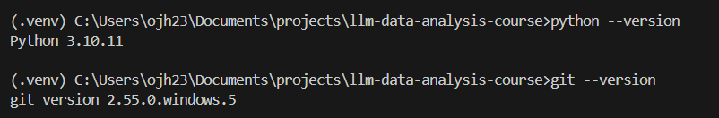
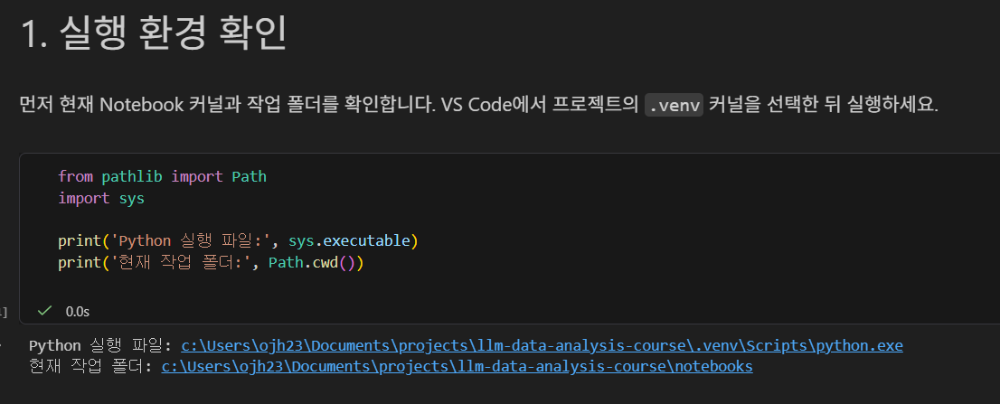
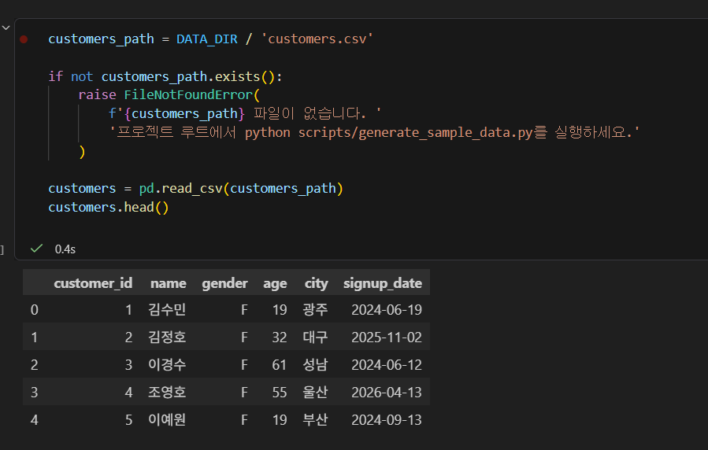
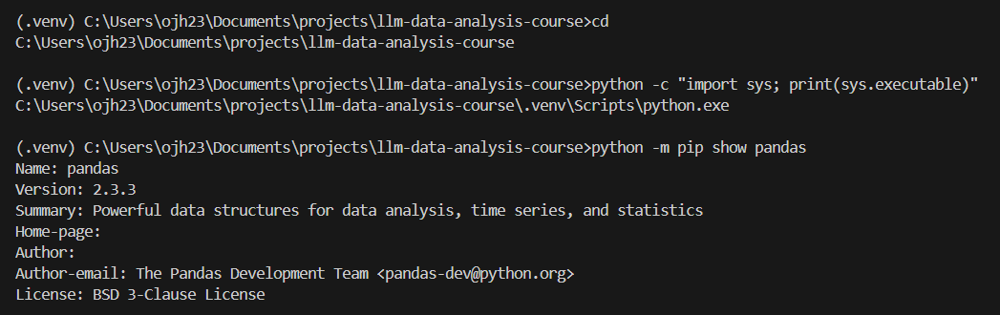
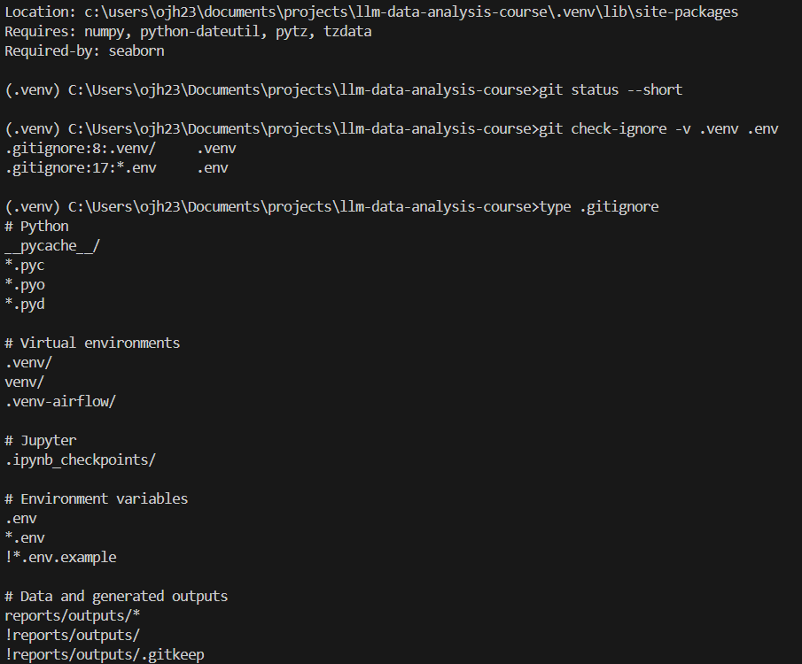

# Chapter 02 제출 답안. VS Code에서 시작하는 데이터 분석 환경

> 최종 파일은 개인 GitHub 저장소의 `chapter02/chapter02.md`로 저장합니다.

## 0. 제출 정보

- 이름:
- GitHub ID: OBHAR
- 개인 저장소: `llm-data-analysis-study`
- 작성일: 2026-09-15
- 운영체제: Windows

### 최종 제출 URL

```text
https://github.com/OBHAR/llm-data-analysis-study/blob/main/chapter02/chapter02.md
```

---

## 1. Python과 Git 환경 확인

### 실행 내용

```text
python --version
git --version
```

### 실행 결과

```text
Python 3.10.11
git version 2.55.0.windows.5
```

### Evidence



### 결과 관찰

Python 3.10.11과 Git 2.55.0.windows.5가 정상적으로 실행되었다. 터미널 프롬프트에 `(.venv)`가 표시되어 프로젝트 가상환경이 활성화된 상태임도 확인했다.

### 나의 해석과 판단

Python은 데이터 분석 라이브러리를 실행할 수 있는 버전으로 확인되었고, Git도 정상적으로 동작하므로 수업 실습과 GitHub 제출을 진행할 수 있는 환경이라고 판단했다.

### 업무·분석적 의미

프로젝트 시작 전에 Python과 Git의 버전 및 실행 가능 여부를 확인하면, 이후 발생하는 설치·실행·업로드 오류의 원인을 환경 문제와 코드 문제로 구분하는 데 도움이 된다.

### 한계와 추가 확인 사항

현재는 로컬 PC 환경에서만 확인했다. 다른 PC나 운영체제에서는 Python 버전, 권한, 네트워크 정책에 따라 설치 과정이 달라질 수 있다.

---

## 2. 저장소와 `.venv` 준비

### 수행 내용

- [x] 공식 Public 저장소 clone
- [x] 프로젝트 루트 확인
- [x] `.venv` 생성
- [x] `.venv` 활성화
- [x] `requirements.txt` 설치

### 핵심 실행 결과

```text
현재 프로젝트 경로: C:\Users\ojh23\Documents\projects\llm-data-analysis-course
터미널 Python 실행 파일: C:\Users\ojh23\Documents\projects\llm-data-analysis-course\.venv\Scripts\python.exe
가상환경 활성화 여부: 활성화됨 (터미널에 (.venv) 표시)
패키지 설치 결과: pandas 2.3.3 설치 확인
```

### Evidence


### 결과 관찰

터미널의 `python`은 프로젝트 내부의 `.venv\Scripts\python.exe`를 가리키며, pandas 2.3.3이 설치되어 있음을 확인했다.

### 나의 해석과 판단

시스템 Python과 프로젝트 `.venv`를 분리하면 프로젝트별 패키지 버전을 독립적으로 관리할 수 있다. 따라서 다른 프로젝트의 패키지와 충돌할 가능성을 줄일 수 있다.

### 업무·분석적 의미

다른 사람이 같은 프로젝트를 재실행할 때 `requirements.txt`와 가상환경을 사용하면 필요한 라이브러리 환경을 일관되게 재구성할 수 있다.

### 한계와 추가 확인 사항

회사·기관 PC의 권한이나 네트워크 정책에 따라 패키지 설치가 제한될 수 있으며, Python 버전 차이로 일부 패키지의 동작이 달라질 수 있다.

---

## 3. VS Code 인터프리터와 Jupyter 커널 연결

### 확인 결과

```text
VS Code Python 인터프리터: C:\Users\ojh23\Documents\projects\llm-data-analysis-course\.venv\Scripts\python.exe
Notebook sys.executable: C:\Users\ojh23\Documents\projects\llm-data-analysis-course\.venv\Scripts\python.exe
Notebook Path.cwd(): C:\Users\ojh23\Documents\projects\llm-data-analysis-course\notebooks
```

### Evidence



### 결과 관찰

터미널과 Notebook이 모두 프로젝트 `.venv`의 Python 실행 파일을 사용하고 있음을 확인했다.

### 나의 해석과 판단

터미널과 Notebook의 Python 환경이 다르면 터미널에서는 설치된 패키지를 Notebook에서 찾지 못하는 문제가 발생할 수 있다. 두 환경을 동일한 `.venv`로 맞추는 것이 필요하다.

### 업무·분석적 의미

실행 경로를 직접 확인하면 `ModuleNotFoundError` 같은 환경 오류를 빠르게 진단하고 줄일 수 있다.

### 한계와 추가 확인 사항

커널 이름만으로 동일한 환경인지 판단하면 안 된다. `sys.executable`로 실제 실행 파일 경로를 확인해야 한다.

---

## 4. 샘플 데이터와 Notebook 실행 검증

### 확인 결과

```text
DATA_DIR 존재 여부: True
customers.csv 존재 여부: 정상적으로 로드됨
customers.shape: (150, 6)
주요 컬럼: customer_id, name, gender, age, city, signup_date
```

### Evidence



### 결과 관찰

`customers.head()`에서 고객 데이터의 처음 5개 행을 확인했다. 데이터는 150행 6열이며, customer_id, name, gender, age, city, signup_date 컬럼으로 구성되어 있다.

### 나의 해석과 판단

Notebook 작업 폴더를 기준으로 프로젝트 루트와 `data/raw` 경로를 정상적으로 찾았고, pandas로 `customers.csv`를 읽을 수 있었다. Python 환경, 파일 경로, 데이터 파일이 정상적으로 연결되었다고 판단했다.

### 업무·분석적 의미

분석 전에 데이터 경로와 기본 로드 결과를 확인하는 스모크 테스트를 수행하면, 이후 분석 단계에서 발생하는 오류를 초기에 발견할 수 있다.

### 한계와 추가 확인 사항

현재 단계에서는 환경과 파일 연결만 확인했다. 결측치, 중복값, 데이터 범위 등 데이터 품질은 아직 검증하지 않았다.

---

## 5. 오류 해결 기록

### 오류 메시지

```text
ModuleNotFoundError: No module named 'pandas'
```

### 원인 후보

1. 프로젝트 `.venv`에 pandas가 설치되지 않았을 수 있다.
2. VS Code Notebook 커널이 프로젝트 `.venv`와 다를 수 있다.
3. 패키지 설치 후 Notebook 커널을 다시 시작하지 않았을 수 있다.

### 내가 확인한 순서

1. Notebook에서 `import pandas as pd` 실행 시 오류를 확인했다.
2. 터미널에서 현재 Python 실행 파일이 `.venv\Scripts\python.exe`인지 확인했다.
3. `requirements.txt`를 설치하고 Notebook 커널을 재시작했다.

### 해결 방법

```text
python -m pip install -r requirements.txt 실행 후,
VS Code Notebook 커널을 프로젝트 .venv로 선택하고 재시작했다.
```

### Evidence



### 나의 해석과 판단

`pandas`가 없다는 오류는 코드 문법 문제가 아니라 현재 Notebook이 사용하는 Python 환경에 패키지가 없을 때 발생한다. 터미널과 Notebook 모두 프로젝트 `.venv`의 Python을 사용하도록 맞춘 뒤 패키지를 설치했으므로, 해당 원인이 가장 가능성이 높다고 판단했다.

### 한계와 추가 확인 사항

패키지나 가상환경 폴더를 임의로 삭제하지 않았다. 회사·기관 PC의 보안 정책이나 프록시 환경에서는 패키지 설치가 제한될 수 있으므로, 설치 오류가 발생하면 정책과 네트워크 환경을 추가로 확인해야 한다.

---

## 6. Secret 보호 확인

- [x] `.env`는 Git 추적 대상이 아닙니다.
- [x] 실제 API Key를 코드에 작성하지 않았습니다.
- [x] 캡처 화면에 Token/비밀번호가 없습니다.
- [x] `.venv`를 Git에 올리지 않습니다.

### Evidence



### 나의 해석과 판단

`.env`에는 API Key, 비밀번호 등 민감한 환경 변수가 포함될 수 있으므로 Git 추적에서 제외해야 한다. 또한 프로젝트별 가상환경인 `.venv`는 용량이 크고 운영체제별 실행 파일이 포함되므로 공유하지 않으며, `requirements.txt`를 통해 동일한 패키지 환경을 재구성하는 방식이 적절하다.

---

## 7. Chapter 02 최종 회고

### 가장 중요했다고 생각한 환경 설정 1가지

```text
VS Code Notebook 커널을 프로젝트 .venv와 동일하게 맞추는 설정
```

### 그 이유

```text
이번 실습에서 pandas를 찾지 못하는 오류를 경험했다. 터미널과 Notebook이 같은 .venv의 Python을 사용하는지 sys.executable로 직접 확인한 뒤 패키지를 설치하고 커널을 재시작하자 정상적으로 실행됐다. 따라서 데이터 분석을 시작하기 전 가장 먼저 확인해야 할 설정이라고 생각한다.
```

### 다음 Chapter에서 재사용할 환경 체크 3가지

1. 터미널에 (.venv)가 표시되고 python 실행 경로가 프로젝트 .venv인지 확인한다.
2. VS Code Notebook 커널의 sys.executable이 프로젝트 .venv와 같은지 확인한다.
3. DATA_DIR과 데이터 파일이 존재하며 pandas로 정상 로드되는지 먼저 확인한다.

### 현재 환경의 한계 또는 주의점

```text
현재 환경은 내 로컬 Windows PC에서 검증했다. 다른 PC에서는 Python 버전, 권한, 네트워크 정책 또는 패키지 버전 차이로 설치와 실행 과정이 달라질 수 있다. 또한 Notebook은 셀 실행 순서에 영향을 받으므로, 오류가 발생하면 커널을 재시작한 뒤 위에서부터 다시 실행해 확인한다.
```

---

## 최종 제출 체크

- [x] 핵심 Evidence 4~7장을 첨부했습니다.
- [x] 단순 캡처가 아니라 관찰과 판단을 작성했습니다.
- [x] Secret/개인정보가 없습니다.
- [x] GitHub에서 이미지가 정상 표시됩니다.
- [x] 개인 저장소에 `chapter02/chapter02.md`를 업로드했습니다.
- [ ] 저장소 URL이 아니라 최종 파일 URL을 제출합니다.
