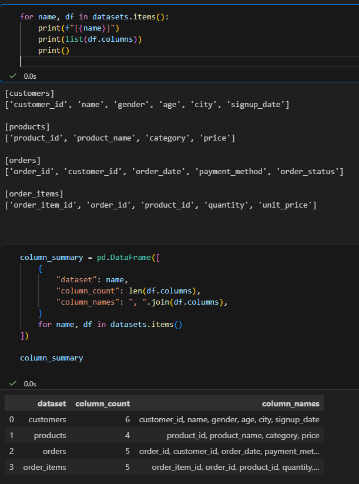
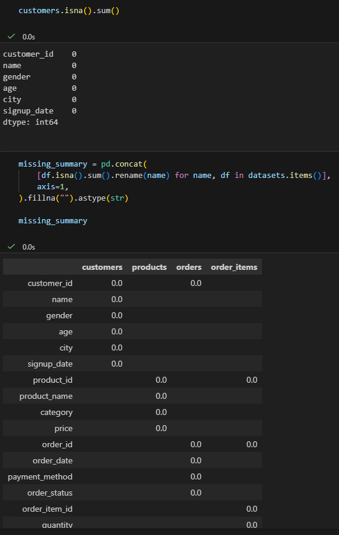
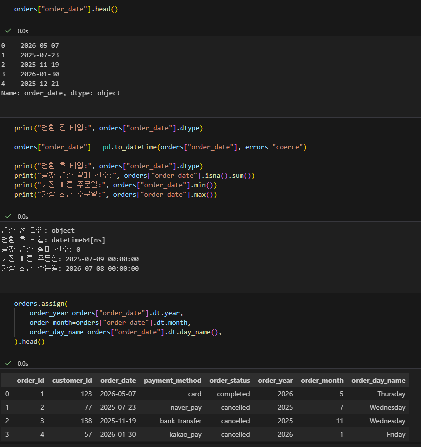
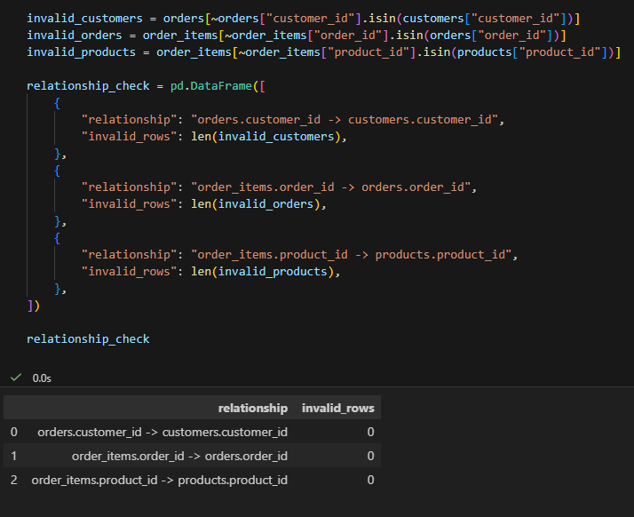
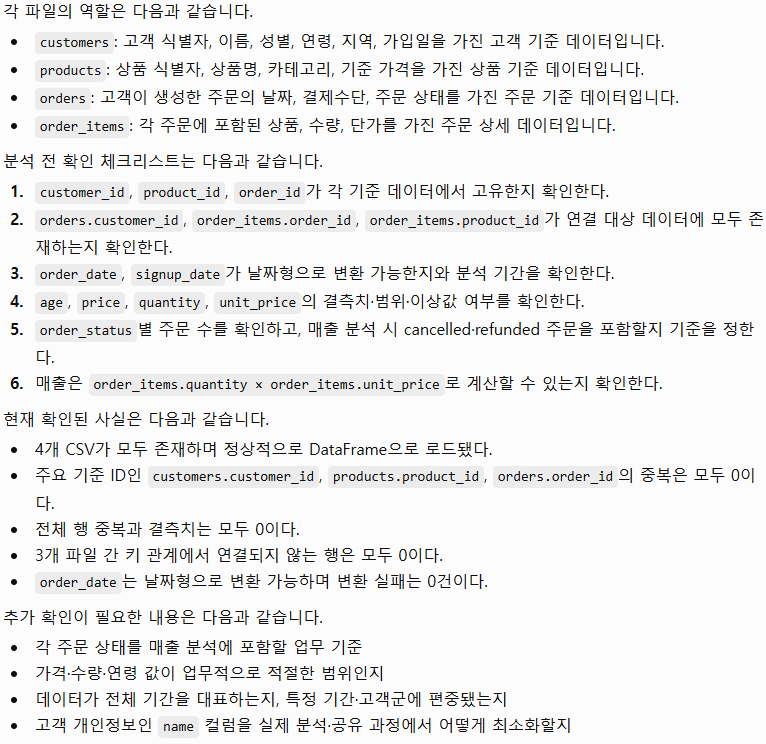

# Chapter 03 제출 답안. 데이터의 첫인상 읽기

> 주 제출물은 실행 완료 Notebook `chapter03/chapter03.ipynb`입니다. 이 문서는 Notebook의 Markdown 셀에 작성한 내용을 함께 정리한 제출 답안입니다.

## 0. 제출 정보

- 이름:
- GitHub ID: OBHAR
- 작성일: 2026-09-18
- 최종 제출 URL: 업로드 후 작성

## 1. 데이터 로딩과 구조 확인

### 실행/결과

- 4개 CSV 로딩 여부: customers, products, orders, order_items 모두 정상 로드
- 각 데이터 shape:
  - customers: (150, 6)
  - products: (100, 4)
  - orders: (300, 5)
  - order_items: (764, 5)
- 주요 컬럼:
  - customers: customer_id, name, gender, age, city, signup_date
  - products: product_id, product_name, category, price
  - orders: order_id, customer_id, order_date, payment_method, order_status
  - order_items: order_item_id, order_id, product_id, quantity, unit_price
- dtypes에서 주목한 컬럼: order_date와 signup_date는 날짜처럼 보이지만 처음에는 문자열(object) 타입이다.

### Evidence

### 결과 관찰

4개 CSV가 모두 존재하며 pandas DataFrame으로 정상 로드됐다. order_items는 764행으로 orders의 300행보다 많았는데, 하나의 주문에 여러 상품 행이 포함될 수 있기 때문이다.

### 나의 해석과 판단

주문일과 가입일은 날짜 분석 전에 날짜형으로 변환해야 한다. 또한 고객 이름은 개인정보이므로 분석 목적에 꼭 필요하지 않다면 사용을 최소화해야 한다.

### 업무·분석적 의미

구조를 먼저 확인하지 않으면 존재하지 않는 컬럼명을 사용하거나, 날짜·숫자 컬럼을 문자열 상태로 처리하여 잘못된 분석 결과가 나올 수 있다.

### 한계와 추가 확인 사항

현재는 파일 구조를 확인한 단계이며, 데이터가 실제 업무 전체를 대표하는지와 값의 업무적 의미는 추가 확인이 필요하다.

## 2. 결측·중복·키 품질

- 주요 ID 결측: customers.customer_id, products.product_id, orders.order_id 모두 0
- 주요 ID 중복: customers.customer_id, products.product_id, orders.order_id 모두 0
- 전체 행 중복: 4개 데이터셋 모두 0

### 결과 관찰

모든 컬럼의 결측치와 결측 비율은 0이었다. 전체 행 중복도 없었으며, 고객·상품·주문 기준 ID도 중복되지 않았다. 다만 order_items.order_id는 464건 중복됐는데, 주문 하나에 여러 상품이 포함될 수 있어 정상적인 반복이다.

### 나의 해석과 판단

기준 ID의 중복과 결측은 우선 확인해야 할 문제이지만, 연결용 외래키인 order_items.order_id의 중복은 삭제 대상이 아니다. 컬럼의 역할을 먼저 구분해야 한다.

### 업무·분석적 의미

중복을 무조건 삭제하면 실제 주문 상세 행을 잃을 수 있다. PK와 FK의 역할을 구분하면 데이터 손실을 막을 수 있다.

### 한계와 추가 확인 사항

결측과 중복이 없더라도 값의 정확성, 오타, 업무 규칙 위반 여부까지 보장하지는 않는다.

## 3. 숫자형·범주형·날짜 점검

- 숫자형 범위에서 주목한 값:
  - age: 19~69
  - price: 50,000~200,000
  - quantity: 1~5
  - unit_price: 5,000~200,000
- 범주형 빈도에서 주목한 값:
  - order_status: completed 184건, cancelled 64건, refunded 52건
  - category: 7개
  - city: 10개
- 날짜 변환 실패 건수: 0
- 날짜 범위: 2025-07-09 ~ 2026-07-08

### 결과 관찰

order_date는 처음에는 object 타입이었지만 datetime64[ns]로 정상 변환됐다. 변환 실패는 없었고 약 1년의 주문 기간이 포함되어 있다. 주문 상태에는 completed 외에 cancelled와 refunded가 존재한다.

### 나의 해석과 판단

현재 숫자형 범위에는 즉시 오류로 보이는 값이 없지만, 가격·수량·연령이 실제 업무 기준에 적절한지는 추가 확인해야 한다. 매출 분석에서는 cancelled와 refunded 주문을 포함할지 기준을 먼저 정해야 한다.

### 업무·분석적 의미

날짜 변환과 주문 상태 기준이 없으면 월별 추이와 매출 집계 결과가 왜곡될 수 있다.

### 한계와 추가 확인 사항

현재 데이터만으로는 취소·환불 주문의 금액 처리 방식과 각 상태의 업무적 정의를 알 수 없다.

## 4. CSV 간 키 관계 검증

- 없는 customer_id: 0
- 없는 order_id: 0
- 없는 product_id: 0

### 결과 관찰

orders.customer_id는 모두 customers.customer_id에 존재했다. 또한 order_items의 order_id와 product_id도 각각 orders와 products에 모두 존재했다.

### 나의 해석과 판단

현재 샘플 데이터에서는 고객–주문–주문상세–상품의 기본 키 관계가 정상적으로 유지된다. 따라서 이후 병합 분석을 진행할 수 있다.

### 업무·분석적 의미

병합 전에 키 관계를 확인하면 조인 과정에서 누락 행이나 잘못된 집계가 생기는 문제를 예방할 수 있다.

### 한계와 추가 확인 사항

키 관계 문제가 발견되더라도 바로 행을 삭제하면 안 된다. 파일 누락, ID 타입 차이, 공백, 수집 시점 차이 등 원인을 먼저 확인해야 한다.

## 5. LLM 구조 설명 검증

- LLM에 제공한 Safe Context: 파일명, 행·열 수, 컬럼명, 파일 간 키 관계만 제공했고 고객 이름이나 원본 거래 행은 제공하지 않았다.
- LLM이 제안한 추가 점검: 기준 ID 고유성, 키 관계, 날짜 변환, 숫자형 범위, 주문 상태별 처리 기준, 매출 계산 컬럼 확인
- 실제 데이터에서 확인한 항목: age 컬럼 존재, age 결측 0건, 고객–주문 키 관계 정상, quantity·unit_price 존재를 확인했다.
- 채택/수정/보류한 내용: 키 관계·날짜 변환·매출 계산 컬럼 점검은 채택했다. cancelled·refunded 주문 포함 기준은 현재 데이터만으로 결정할 수 없어 보류했다.

### 나의 해석과 판단

LLM 제안 중 파일 역할과 추가 점검 항목을 체크리스트로 정리한 부분이 유용했다. 다만 주문 상태의 업무적 의미나 값의 적절성은 실제 데이터만으로 단정할 수 없으므로, LLM 답변을 그대로 분석 결론으로 사용하면 안 된다.

### 한계와 추가 확인 사항

LLM은 제공된 구조 정보 밖의 업무 규칙을 알 수 없다. 모든 제안은 실제 컬럼, 실행 결과, 업무 담당자 확인을 통해 검증해야 한다.

## 6. Chapter 03 최종 판단

### 데이터의 첫인상 3가지

1. 4개 CSV는 고객, 상품, 주문, 주문 상세로 역할이 분리되어 있고 키 관계도 정상이다.
2. 결측치와 전체 행 중복, 기준 ID 중복은 없어서 기본적인 데이터 품질은 양호하다.
3. 주문 상태에 cancelled와 refunded가 포함되어 있어, 매출 분석 전 포함 기준을 정해야 한다.

### 다음 Chapter 전에 반드시 확인/처리해야 할 항목

1. 매출 분석에서 completed, cancelled, refunded 주문을 처리하는 기준을 정한다.
2. order_date와 signup_date를 분석 목적에 맞게 날짜형으로 관리한다.
3. name 등 개인정보 컬럼은 분석·공유 과정에서 사용을 최소화한다.

### 현재 데이터만으로 단정할 수 없는 것

각 주문 상태의 정확한 업무 정의, 취소·환불 금액의 회계 처리 방식, 그리고 이 샘플 데이터가 실제 전체 고객과 주문 패턴을 대표하는지는 현재 데이터만으로 단정할 수 없다.

## 최종 제출 체크

- [ ] Notebook을 처음부터 끝까지 실행했습니다.
- [ ] 오류 셀이 남아 있지 않습니다.
- [ ] 핵심 Evidence를 첨부했습니다.
- [x] 관찰과 해석을 구분했습니다.
- [x] 개인정보/Secret이 없습니다.
- [ ] `chapter03/chapter03.ipynb`가 GitHub에서 정상 표시됩니다.
- [ ] 최종 Notebook 파일 URL을 제출합니다.
